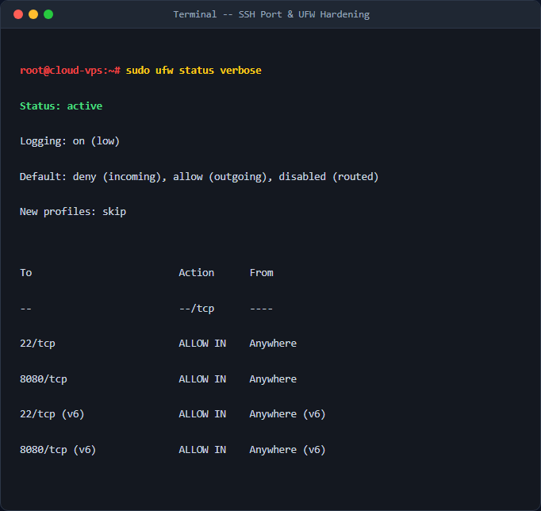
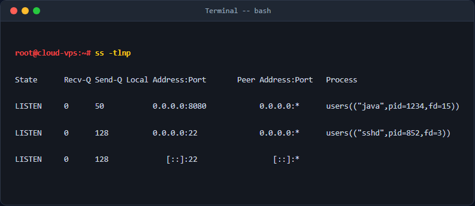

# Cấu hình tường lửa UFW và chuẩn đoán cổng mạng

## 1. Mục tiêu & Bối cảnh kỹ thuật
Tài liệu này hướng dẫn quy trình cấu hình tường lửa UFW (Uncomplicated Firewall) trên hệ điều hành Linux Ubuntu Server để bảo vệ máy chủ Cloud VPS chuẩn bị triển khai ứng dụng web Java/Spring Boot lắng nghe tại cổng 8080. Cấu hình tuân thủ nguyên tắc bảo mật tối thiểu (least privilege), khóa toàn bộ kết nối đến không cần thiết và chỉ mở các cổng quản trị SSH (22) cùng cổng ứng dụng (8080).

## 2. Các bước thực hiện chi tiết
- **Bước 1: Thiết lập chính sách mặc định của UFW**
  - Chạy lệnh `sudo ufw default deny incoming` để từ chối toàn bộ kết nối đi vào máy chủ.
  - Chạy lệnh `sudo ufw default allow outgoing` để cho phép máy chủ chủ động kết nối ra ngoài (tải gói tin, gọi API).
- **Bước 2: Mở các cổng cần thiết**
  - Chạy lệnh `sudo ufw allow 22/tcp` cho phép kết nối SSH quản trị hệ thống.
  - Chạy lệnh `sudo ufw allow 8080/tcp` cho phép truy cập ứng dụng web.
- **Bước 3: Kích hoạt tường lửa**
  - Chạy lệnh `sudo ufw enable` để bật tường lửa cùng hệ thống.

## 3. Kiểm tra & Xác thực kết quả
- Kiểm tra trạng thái chi tiết của UFW:
  ```bash
sudo ufw status verbose
  ```
  

- Kiểm tra các cổng đang lắng nghe trên hệ thống:
  ```bash
ss -tlnp
  ```
  

## 4. Kết luận & Best Practices bảo mật vận hành
- Luôn luôn đảm bảo mở cổng SSH (hoặc cổng custom SSH) trước khi kích hoạt tường lửa để tránh bị mất kết nối từ xa.
- Kết hợp sử dụng công cụ `ss` hoặc `netstat` để kiểm tra thực tế tiến trình nào đang chiếm giữ cổng mạng.
- Thường xuyên kiểm tra log tường lửa để phát hiện các hành vi quét cổng trái phép.